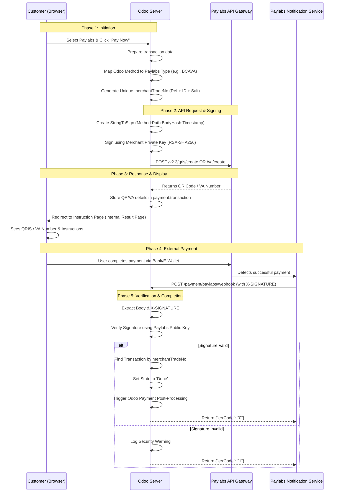

# Flow Logic: Paylabs Odoo Module

This document provides a deep dive into the logic flow of the Paylabs Odoo integration, covering everything from the user's click to the final payment confirmation.

---

## 1. High-Level Sequence Diagram

The following diagram illustrates the interaction between the Customer, Odoo, and the Paylabs API.

---

## 2. Detailed Logical Components

### A. Trade Number Uniqueness (merchantTradeNo)
**Logic**: Paylabs strictly forbids duplicate trade numbers. If a customer fails a payment and tries again for the same order, Odoo's standard reference might trigger a "Duplicate" error.
**Solution**:
1.  Take the Odoo `reference` (e.g., `S00001`).
2.  Append the internal `transaction_id` (e.g., `45`).
3.  Append a short random salt based on `timestamp`.
**Result**: `S00001-45-7821` (Guaranteed unique even on retries).

### B. Payment Type Mapping
**Logic**: Odoo uses generic codes like `bank_bca`. Paylabs v2.3 requires specific case-sensitive strings.
**Mapping Flow**:
- `bca` / `bank_bca` / `bca_va` -> **`BCAVA`**
- `mandiri` -> **`MandiriVA`**
- `qris` -> **`QRIS`**
- Fallback: Capitalize and append `VA` (e.g., `bni` -> `BNIVA`).

### C. Webhook Idempotency
**Logic**: Payment Gateways often send notifications multiple times to ensure delivery.
**Execution**:
1.  Check if `payment.transaction` is already in `done` or `cancel` state.
2.  If `done`, simply acknowledge the webhook with `errCode: 0` without reprocessing.
3.  This prevents duplicate accounting entries.

---

## 3. Security Flow (RSA-SHA256)

The security logic ensures that neither the Request nor the Notification can be faked.

### Outgoing Request Signing:
1.  **Body**: Compact JSON (no whitespace).
2.  **Payload Hash**: SHA256 of the Body.
3.  **StringToSign**: `POST:/payment/v2.3/path:HASH:TIMESTAMP`.
4.  **Signing**: Encrypt the StringToSign's SHA256 hash with your **Private Key**.

### Inbound Webhook Verification:
1.  **Payload Hash**: SHA256 of the raw Request Body.
2.  **StringToSign**: `POST:/payment/paylabs/webhook:HASH:TIMESTAMP`.
3.  **Verification**: Decrypt the provided `X-SIGNATURE` using **Paylabs Public Key** and compare it with the local StringToSign.

---

## 4. State Machine Transition

| Trigger Event | Initial State | API Response | New State | Odoo Action |
| :--- | :--- | :--- | :--- | :--- |
| Click "Pay Now" | `draft` | Success | `pending` | Display QR/VA |
| Webhook (Status 02) | `pending` | Valid Sign | `done` | Confirm Order/Invoice |
| Webhook (Status 09) | `pending` | Valid Sign | `cancel` | Log Failure |
| Manual Expire | `pending` | N/A | `cancel` | - |

---
*Documented for Developer Reference - Paylabs Odoo Integration*
