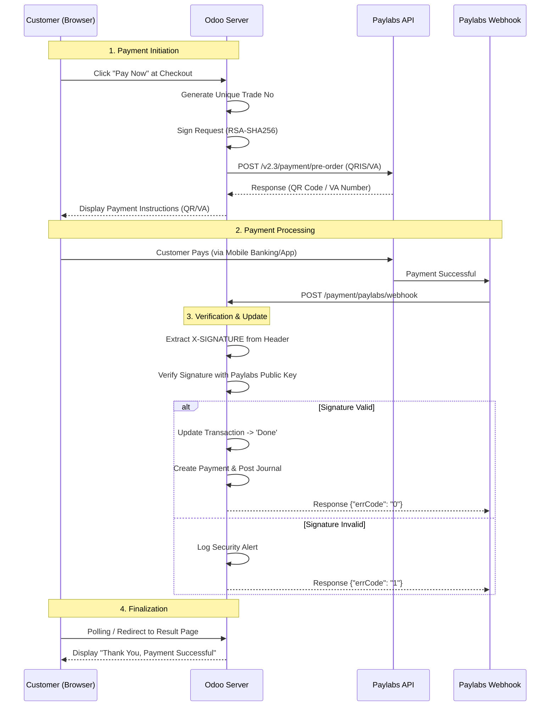

# Technical Architecture and Logic Flow: Paylabs Odoo Module

This document explains the Python code structure, the responsibilities of each module, and the data flow from transaction creation to payment verification.

---

## 1. Python Module Structure

This module follows the standard Odoo Payment Provider architecture with several additional components to handle Paylabs API security.

### A. `models/` Folder (Data & Business Logic)
*   **`payment_provider.py`**: 
    *   Defines backend configuration (Merchant ID, RSA Keys).
    *   Handles payment method icon synchronization logic.
    *   Determines the environment (Sandbox/Production).
*   **`payment_transaction.py`**:
    *   The heart of the transaction process.
    *   `_get_specific_create_values()`: Prepares data before sending it to the API.
    *   `_send_payment_request()`: Sends VA/QRIS creation requests to Paylabs.
    *   `_handle_notification_data()`: Processes data coming from the webhook.

### B. `controllers/` Folder (Web Endpoints)
*   **`main.py`**:
    *   Handles webhooks from Paylabs (`/payment/paylabs/webhook`).
    *   Performs `X-SIGNATURE` verification on every incoming request.
    *   Provides payment instruction pages (QRIS/VA) after checkout.

### C. `utils/` Folder (API Helper & Security)
*   **`api_client.py`**: Wrapper for REST API communication with Paylabs (v2.3). Handles automatic security header injection.
*   **`signature.py`**: RSA-SHA256 encryption logic for signature generation (requests) and signature verification (webhooks).

---

## 2. Transaction Flow

The following sequence diagram illustrates the process from the moment a customer clicks "Pay Now" until the transaction is finalized.

---

## 3. Key Logic Explanation

### A. Security Mechanism (RSA-SHA256)
Paylabs requires every request to have an `X-SIGNATURE` header. 
*   **Request**: Odoo uses the **Merchant Private Key** to sign a string consisting of `Method + Path + Token + Body + Timestamp`.
*   **Webhook**: Odoo uses the **Paylabs Public Key** to verify the signature sent by Paylabs in the header. This ensures data integrity and prevents tampering.

### B. Webhook Handling (Idempotency)
This module is designed to safely handle cases where Paylabs sends a webhook multiple times (retries).
1.  The system searches for a transaction based on `merchantTradeNo`.
2.  If the transaction status is already `done`, the system ignores subsequent notifications but still returns a success response to Paylabs to stop further retries.

### C. Asset Synchronization (Smart Icons)
The `action_refresh_payment_icons` function automatically maps image files in `static/src/img/payment_methods/` to `payment.method` records in the Odoo database. This simplifies administration as bank logos (BCA, Mandiri, etc.) will appear automatically without manual upload.

---

## 4. Requirement Dependencies
This module depends on the following Python libraries:
1.  `pycryptodome`: For `RSA` and `PKCS1_v1_5` functions.
2.  `requests`: For HTTP communication.
3.  `pytz`: To ensure timestamps always use the `Asia/Jakarta` timezone.

---
*This document is part of the technical guide for Paylabs Odoo Integration.*
